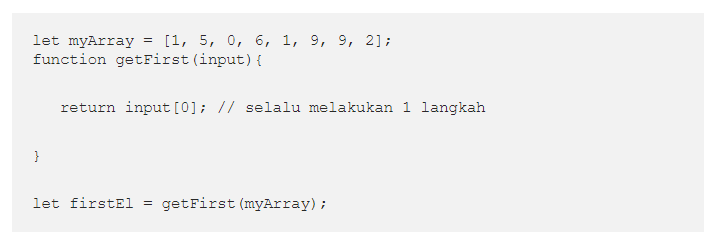
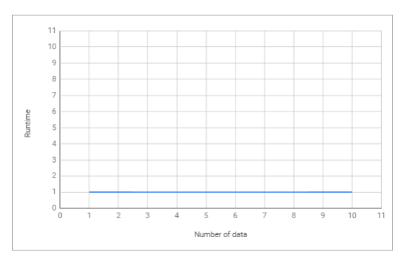
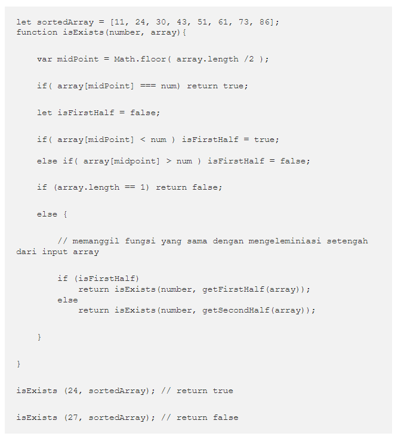
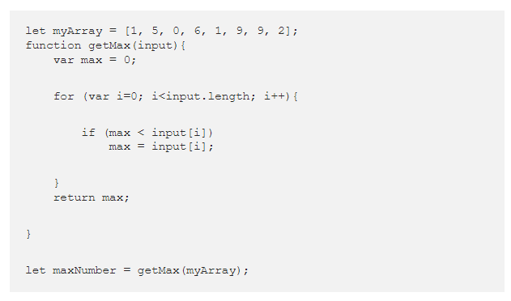
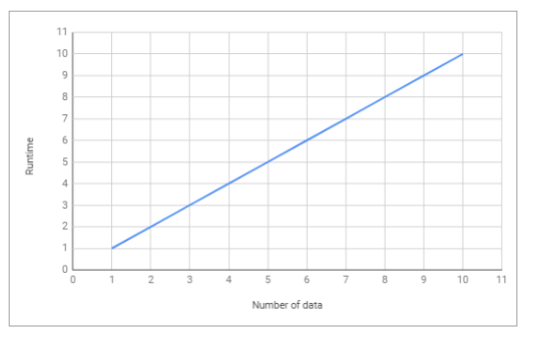
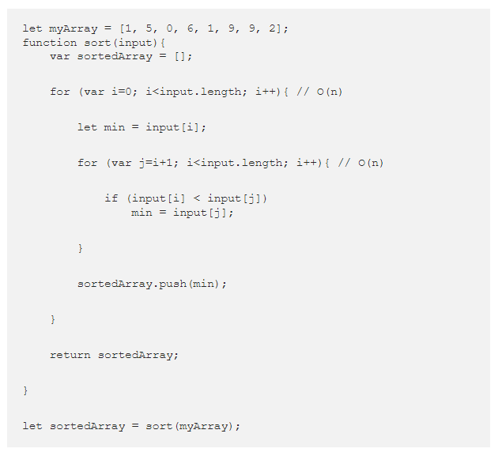
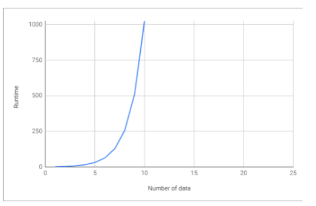
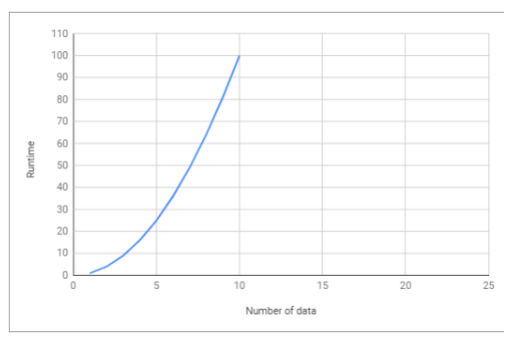

# Penjelasan Sederhana Tentang Time Complexity dan Big-O Notation

Setiap programmer yang baik akan menggunakan cara yang paling efektif dan efisien dalam menyelesaikan suatu permasalahan. Dan untuk bisa melakukan hal tersebut, kita harus bisa meminimalisir kompleksitas dari algoritma yang kita gunakan.

Kompleksitas suatu algoritma dibagi menjadi 2, yaitu Time Complexity dan Space Complexity.

Time Complexity adalah seberapa lama waktu yang diperlukan untuk menjalankan suatu algoritma. Sedangkan Space Complexity adalah seberapa besar memori yang kita gunakan untuk menjalankan suatu algoritma. Dan disini kita hanya akan membahas tentang Time Complexity.

## Algoritma
Sebelum kita melanjutkan pembahasan, kita harus mengerti dulu apa itu algoritma/fungsi.

Sederhananya, algoritma adalah serangkaian proses yang dilakukan secara berurutan untuk menyelesaikan sebuah permasalahan. Algoritma bisa bermacam-macam tergantung kepada siapa yang membuat algoritma tersebut. Namun permasalahannya adalah algoritma mana yang lebih efektif dan efisien?

Seperti halnya yang sering kita hadapi dalam permasalahan sehari-hari, ketika kita akan berpergian ke suatu tempat. Kita tahu ada banyak jalan yang bisa dilalui untuk bisa sampai di tempat tujuan, namun permasalahannya adalah rute mana yang paling cepat yang bisa kita ambil untuk sampai di tempat tujuan?

Time Complexity Analysis adalah suatu cara sederhana untuk mengetahui berapa lama waktu yang dibutuhkan untuk menjalankan suatu algoritma dengan input tertentu (n). Biasanya lebih dikenal dengan sebutan Big-O Notation.

Big O Notation digunakan untuk mengukur tingkat kompleksitas suatu algoritma.

Big-O Notation adalah cara untuk mengkonversi keseluruhan langkah-langkah suatu algoritma kedalam bentuk Aljabar, yaitu dengan menghiraukan konstanta yang lebih kecil dan koefisien yang tidak berdampak besar terhadap keseluruhan kompleksitas permasalahan yang diselesaikan oleh algoritma tersebut.

Mari kita liat contoh dibawah ini:

Sederhananya, semua contoh yang ada diatas mengatakan bahwa “kita hanya akan melihat faktor yang memiliki dampak paling besar terhadap nilai yang dihasilkan oleh algoritma tersebut”.

Terdapat beberapa macam time complexity, diantaranya:

1. O(1) — Constant Time

Constant Time artinya banyaknya input yang diberikan kepada sebuah algoritma, tidak akan mempengaruhi waktu proses (runtime) dari algoritma tersebut.

Contoh diatas, terdapat sebuah fungsi untuk mengambil elemen pertama dari sebuah input array. Kita bisa melihat bahwa berapapun jumlah array yang diberikan kepada fungsi tersebut, dia akan selalu melakukan 1 hal, yaitu mengambil elemen pertama. Itu artinya jumlah input yang diberikan tidak mempengaruhi waktu proses (runtime) dari algoritma tersebut.

2. O(log n) — Logarithmic Time

Logarithmic Time artinya ketika kita memberikan input sebesar n terhadap sebuah fungsi, jumlah tahapan yang dilakukan oleh fungsi tersebut berkurang berdasarkan suatu faktor. Salah satu contohnya adalah algoritma Binary Search.

Binary Search adalah algoritma yang kita gunakan dalam mencari posisi nilai dari suatu array dengan cara ‘mengeliminasi’ setengah dari array input untuk mempercepat proses pencarian.

3. O(n) — Linear Time

Linear Time adalah ketika runtime dari fungsi kita berbanding lurus dengan jumlah input yang diberikan.

Kita bisa melihat bahwa semakin banyak jumlah input yang diberikan, maka waktu proses/runtime dari fungsi tersebut akan semakin besar.

4. O(n²) — Quadratic Time

Quadratic Time adalah ketika runtime dari fungsi kita adalah sebesar n^2, dimana n adalah jumlah input dari fungsi tersebut. Hal tersebut bisa terjadi karena kita menjalankan fungsi linear didalam fungsi linear (n*n).

5. O(2^n) — Exponential Time

Exponential Time biasanya digunakan dalam situasi dimana kita tidak terlalu tahu terhadap permasalahan yang dihadapi, sehingga mengharuskan kita mencoba setiap kombinasi dan permutasi dari semua kemungkinan.

## Kesimpulan
Sebagai programmer, kita sering kali dihadapkan dengan adanya beberapa solusi untuk sebuah permasalahan dan kita dibingungkan dengan pertanyaan “mana solusi yang lebih efisien?”.

Dengan memahami Big-O Notation, kita akan lebih mudah dalam melihat mana algoritma yang lebih efisien yang bisa kita gunakan untuk menyelesaikan permasalahan yang sedang dihadapi.